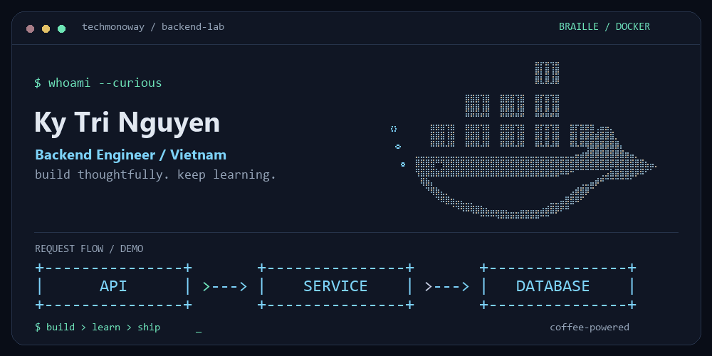

BACKEND ENGINEER · VIETNAM

# Hey, I'm Ky Tri Nguyen 👋

Building thoughtful backend systems. Always learning, always shipping.

  

A Docker whale, a little Braille art, and a lot of curiosity.

## A little about me

I'm a **Backend Engineer at Nexxa**, based in **Vietnam**, with a background in **Computer Science**. I enjoy turning ideas into well-structured systems, especially where backend architecture meets cloud computing.

| Right now | What I'm exploring |
| :--- | :--- |
| **Building** | Scalable backend systems and solutions at Nexxa |
| **Learning** | Advanced backend frameworks and system design |
| **Collaborating** | Interesting open-source projects |
| **Off the keyboard** | Usually refilling my coffee ☕ |

> Code is poetry — make it elegant.

## My toolbox

  

| Area | Technologies |
| :--- | :--- |
| **Languages** | TypeScript · JavaScript · Python · Go · Java · Dart |
| **Backend** | Node.js · Express |
| **Data & services** | PostgreSQL · MongoDB · MySQL · Oracle · Firebase · Appwrite |
| **Cloud & tools** | AWS · Docker · Git · Linux · VS Code |
| **Frontend** | React · Next.js · Redux · Tailwind CSS |

<b>A few more things in the toolbox</b>

HTML5 · CSS3 · Sass · Bootstrap

## Beyond the code

I like learning how systems fit together, exploring cloud infrastructure, and sharing the process through open source. If you're working on something interesting, I'd love to hear about it.

<b>GitHub activity & stats ↗</b>

 

  

  

  

---

**Have an idea? Let's build it.**

[LinkedIn](https://www.linkedin.com/in/ky-tri-nguyen-016050241/) · [Email](mailto:nguyentriky0604@gmail.com) · [Facebook](https://www.facebook.com/kytechmo.tri) · [X](https://www.x.com/Trikynguci)

Discord: strawberry0604 · Coffee in, clean code out.

